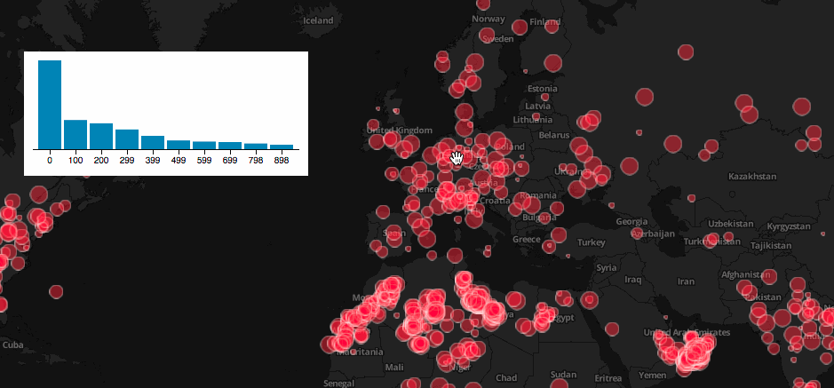

This is a torque widget that shows an histogram of the values



## how to use it

include torque.histogram css and javascript

```
  <link rel="stylesheet" href="torque.histogram.css" />
  <script src="torque.histogram.js"></script>
```

don't forget to include d3 library too

```
  <script src="https://cdnjs.cloudflare.com/ajax/libs/d3/3.5.6/d3.js" charset="utf-8"></script>
```

Create the torque layer and a div to add the widget to the DOM and do:

```js
    torque.widgets.histogram('#histogram', torqueLayer);
```

see [test.html](test.html) for an example usage. It shows the mass for every meteorite impact recorded.
